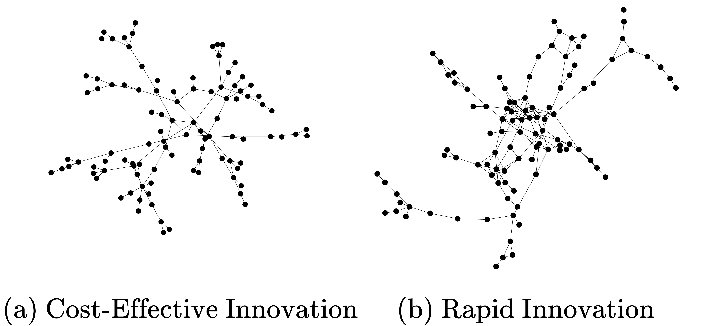

# InnovationNetworks

Repository for the Innovation Networks project, accepted for NetSciX 2024.

## About

This project takes fits empirical social netowrks to an [agent-based model](https://journals.plos.org/plosone/article?id=10.1371/journal.pone.0294228) (ABM). After determining the reinforcement and novelty parameters, the ABM generates multiple 50-node networks to represent the original network. [Innovation simulations](https://github.com/tsukuba-websci/InnovationNetworks) are then conducted to assess how reinforcement and novelty impact innovation efficiency. The project also compares different empirical networks with innovation-optimal networks to identify differences.

## Table of Contents

- [Installation](#installation)
- [Usage](#usage)

## Installation

Instructions on how to install and set up the project.

## Project Structure

The following is an overview of the project structure:

 - empirical: 
 - fitting: 
 - full_search:
 - qd: used to find the best fit parameters using a quality-diversity algorithm
 - visualise: used to create plots of the results
 - webapp: used to visualise the networks in the browser
 - lib: contains the innovation simulation model, the network measuring tools and other necessary functions
 - calculate_metrics: used to calculate the networks metrics (clustering coefficient, youth coefficient, etc.) for a given network

## Usage

